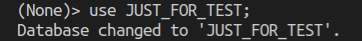
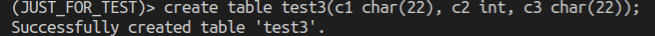
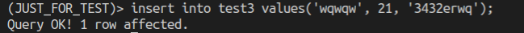
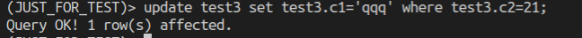
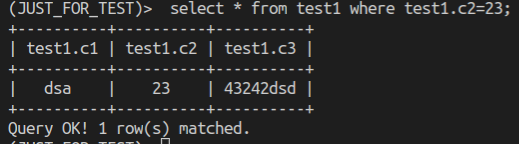
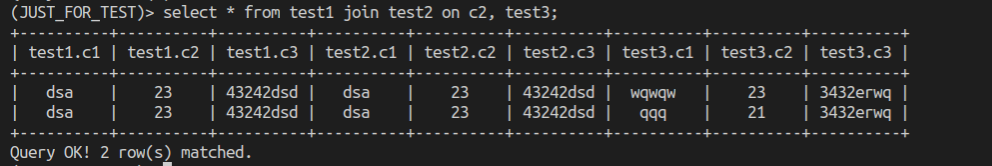

# Simple-DBMS

## Lexer and Yacc

1. At first we use the ply package to implement a simple sql interpreter.

2. Second, we use Lexer to do lexical analysis, the main task of lexical analysis is to identify the keywords.

3. And then, we use Yacc to do grammatical analysis, the main task of grammatical analysis is to identify the expressions which represesnt the functions.

4. At last, we implement the functions corresponding to the grammar, all data is stored in txt file.

## Examples

1. switch database

    

2. create database

    

3. insert table

    

4. update table

    

4. select table

    

5. select table with join

    
    
